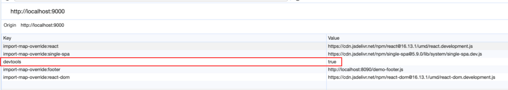

# Microfrontends with Single SPA

This repository contains the codebase for a microfrontend architecture using Single SPA. The project is divided into separate folders for different microfrontends and a shell application to orchestrate them. Follow the steps below to set up and run the project. In this example we gonna use ReactJs and VueJs for demo purpose but for sure it apply in the same way for other JS frameworks, check the list here: https://single-spa.js.org/docs/ecosystem

## Setup Instructions

### 1. Footer Microfrontend (ReactJs)

Navigate to the `footer` folder:

```bash
cd footer
npm install
npm start
```

### 2. Main Microfrontend (VueJS)

Navigate to the `main` folder:

```bash
cd main
npm install
npm run serve
```

### 3. Navbar Microfrontend (ReactJs)

Navigate to the `navbar` folder:

```bash
cd navbar
npm install
npm start
```

### 4. Shell Application

Navigate to the `shell` folder:

```bash
cd shell
npm install
```

#### 4.1 Update Import Maps

Edit the `index.ejs` file and double-check the ports for other projects in the systemjs-importmap script. Adjust the URLs as needed:

```html
<script type="systemjs-importmap">
    {
      "imports": {
        "react": "https://cdn.jsdelivr.net/npm/react@16.13.1/umd/react.production.min.js",
        "react-dom": "https://cdn.jsdelivr.net/npm/react-dom@16.13.1/umd/react-dom.production.min.js",
        "@demo/root-config": "//localhost:9000/demo-root-config.js",
        "@demo/navbar": "http://localhost:8082/demo-navbar.js",
        "@demo/main": "http://localhost:8080/js/app.js",
        "@demo/footer": "http://localhost:8081/demo-footer.js"
    }
    }
</script>
```

#### 4.2 Start Shell Application

Run the following command to start the shell:

```bash
npm start
```

### 5. Accessing the Microfrontends

Navigate to [http://localhost:9000/](http://localhost:9000/) to access the shell application. Ensure that the `devtools` item in the local storage is set to `true` to view the results in the root.


Now, you should have a running microfrontend architecture using Single SPA. Each microfrontend can be developed and tested independently, and the shell orchestrates them for a seamless user experience.